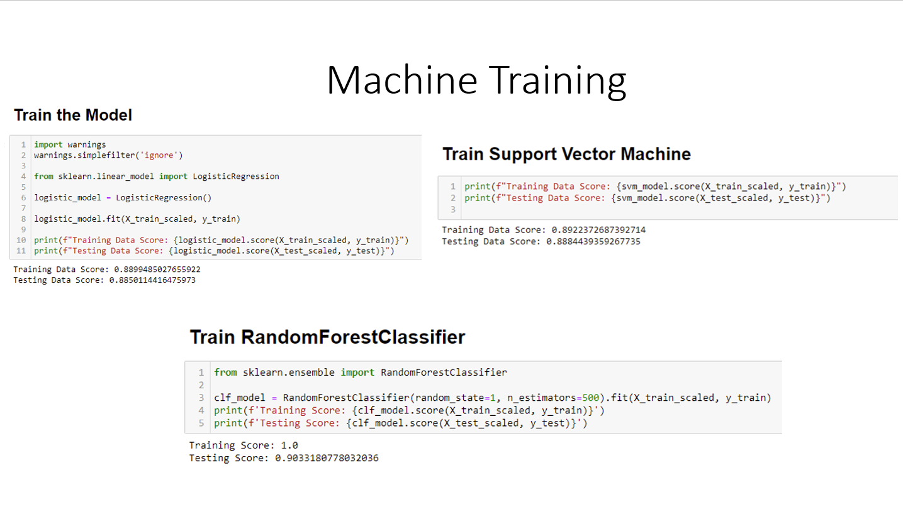
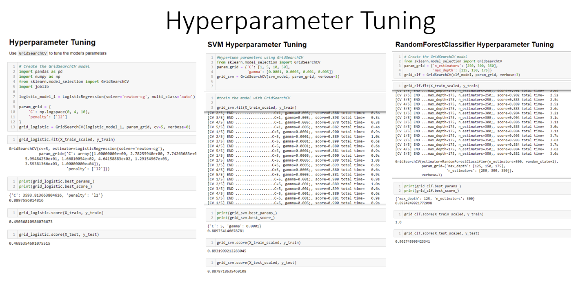
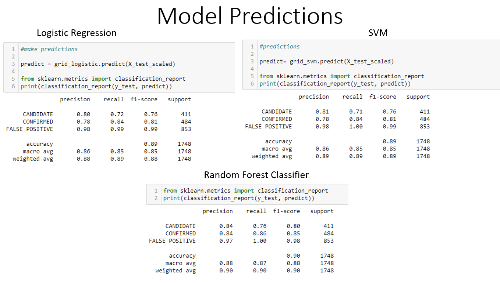

# Machine Learning Homework - Exoplanet Exploration

### Before You Begin

1. Create a new repository for this project called `machine-learning-challenge`. **Do not add this homework to an existing repository**.

2. Clone the new repository to your computer.

3. Give each model you choose their own Jupyter notebook, **do not use more than one model per notebook.**

4. Save your best model to a file. This will be the model used to test your accuracy and used for grading.

5. Commit your Jupyter notebooks and model file and push them to GitHub.

## Background

Over a period of nine years in deep space, the NASA Kepler space telescope has been out on a planet-hunting mission to discover hidden planets outside of our solar system.

To help process this data, you will create machine learning models capable of classifying candidate exoplanets from the raw dataset.

In this homework assignment, you will need to:

1. [Preprocess the raw data](#Preprocessing)
2. [Tune the models](#Tune-Model-Parameters)
3. [Compare two or more models](#Evaluate-Model-Performance)

- - -

## Instructions

### Preprocess the Data

* Preprocess the dataset prior to fitting the model.
* Perform feature selection and remove unnecessary features.
* Use `MinMaxScaler` to scale the numerical data.
* Separate the data into training and testing data.

### Tune Model Parameters

* Use `GridSearch` to tune model parameters.
* Tune and compare at least two different classifiers.

### Reporting

### Machine Training Comparison Results:

### Hyperparameter Tuning Comparison Results:

### Prediction Comparson Results:

   ## As indicated on the slides above the best model for this dataset is the Random Forest Classifier with best training/testing scores, even after the hyperparameters were  tuned. The Random Forest Classifier also have better prediction scores compared to the Logistic Regression and Support Vector Machine.

- - -

